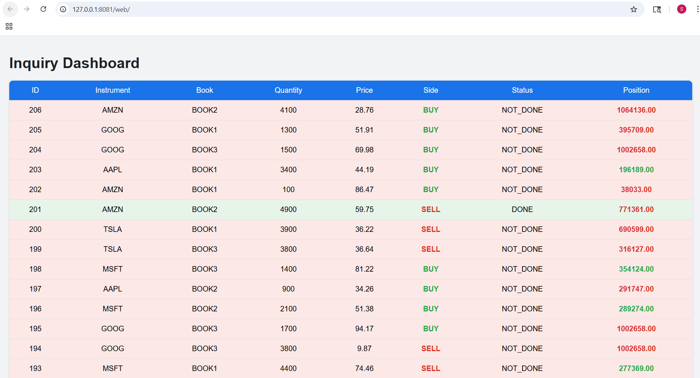

# 📈 Event-Driven Trading System

A event-driven trading system designed to demonstrate how modern trading platforms are built using **event streaming, microservices, and real-time communication**.

This project focuses on **decoupled services**, **asynchronous processing**, and **real-time updates**, similar to architectures used in real-world institutional trading systems.

---

## 🧠 Overview

The system processes inquiry events (inquiries and positions) using an **event-driven architecture**.  
Services communicate via **Kafka based event bus**, and updates are pushed to a **NodeJs based UI using WebSockets**.

This project is intended for:
- Demonstrating event-driven system design
- Demonstrating trading-system architecture
---

## 🧩 Key Features

- ✅ Event-driven microservice architecture
- ✅ Kafka-based event bus
- ✅ Redis based position management
- ✅ Protobuf-based message serialization
- ✅ WebSocket-based real-time UI updates
- ✅ Modular services (easy to extend)
- ✅ Mock trading logic (auto-trader)

---

## ⚠️ Project Status & Limitations

> **Important:** This project is a **Proof of Concept** and is **not production-ready**.

* **Production Readiness:** This project lacks the necessary security, logging, and scalability configurations for a production environment.
* **No TDD:** This project does **not** demonstrate Test Driven Development (TDD).
* **Basic Testing:** Integration tests are minimal and provide only basic coverage of core functionality.

## 🏛 Architecture


## 🎯 Modules

### Kafka Event bus
Acts as the decoupled messaging backbone that streams trade inquiries and execution events between microservices in real-time.

### Position Store - Redis
Provides a high-speed, in-memory data layer for sub-millisecond retrieval and updates of current trading positions.

### Inquiry Generator 
Orchestrates the start of the workflow by creating and publishing trade inquiries.

### Position Service
Responsible for the business logic of tracking position and enriching inquiries with position.

### Auto Trader
A mock algo engine which is reponsible for accepting and rejecting trades. In real life this will depend on maket signals and various other facts in deciding the action.

### Websocket Backend (Websocket Server)
Websocket server based on Vert.x, responsible for publishing protobuf based inquiries to UI.

### Web(Inquiry Dashboard)
A nodejs backed web application. Uses javascript for invoking backend websocket server. Communicate using protobuf to backend server.


### common
Common module include multiple shared artifacts. 
1. Protobuf based model defenition.
2. Kafka Producer and Consumer utils
3. Shared constants

### Integration Test

A simple integration test is included in the project to make sure position is calculated  accurately and messages are sequenced correctly.

## How to Run
Once you checkout the project follow below instructions to start the application. Ideally you should import the prioject in to an IDE like intellij.

## 🛠 Prerequisites

Before you begin, ensure your environment meets the following version requirements:

* **Java JDK 21**: Required for modern language features and Virtual Threads.
    * Check version: `java -version`
* **Apache Maven 3.9+**: For managing the Java build lifecycle.
    * Check version: `mvn -v`
* **Node.js 20+ (LTS)**: For the frontend development server and build tools.
    * Check version: `node -v`
* **Google Chrome**: Recommended browser for optimal performance and debugging.
  
### Run
Build the application by running below command
```bash
mvn clean install
```
Initialize nodejs by running below commands
```bash
cd web
npm init -y
npm install -g http-server
```
Run 'run' script from project root folder. This script will start multiple processes. Below is a list
1. Kafka event bus (A single node kafka cluster)
2. Position store (A single node Redis cluster)
3. Inquiry generator
4. Position Service
5. Auto Trader
6. Websocket Server
7. Node http server
8. Chrome browser with Inquiry dashboard
   
```bash
run
```

### Run integration test

Run 'integration-test' script from project root folder. This script will start multiple processes. Below is a list
1. Kafka event bus (A single node kafka cluster)
2. Position store (A single node Redis cluster)
3. Inquiry generator for Integration test
4. Position Service
5. Auto Trader for Integration test
6. Websocket Server
7. Websocket client for integration testing which verifies and guarantees sequencing of inquiries and value of position.
   
```bash
integration-test
```


